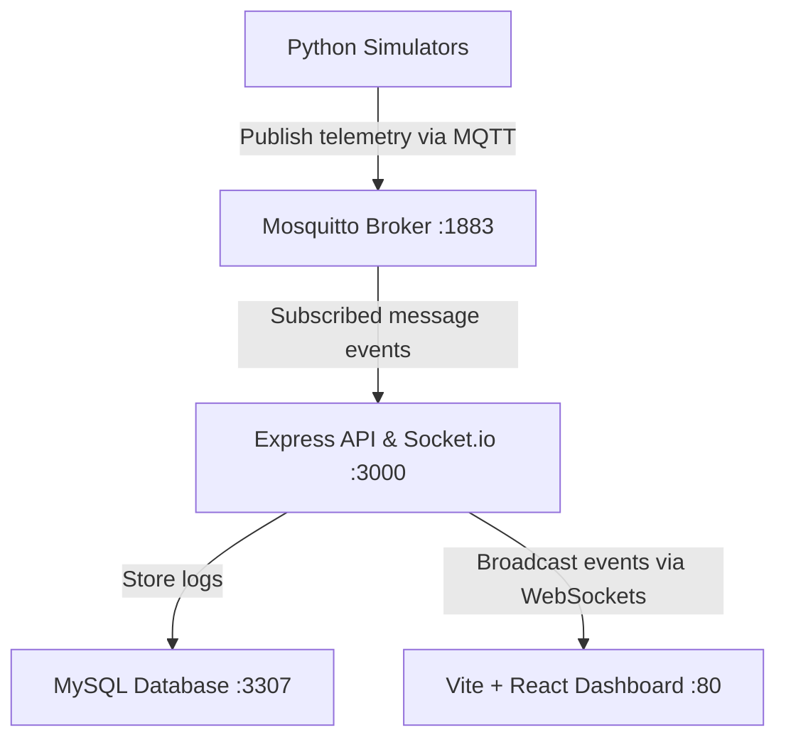

# Système d'Information Voyageurs (SIV) - Full-Stack IoT Dashboard

This project is a full-stack IoT Passenger Information System designed to monitor a public transit fleet in real-time. It simulates buses traveling along Casablanca routes, sends telemetry via MQTT, processes and stores data in a MySQL database, and broadcasts updates via WebSockets to an interactive React dashboard.

## 🏗️ System Architecture

The project is structured as a monorepo containing the following components:



* **Frontend**: Built with React (Vite), styled with modern CSS, using Leaflet Maps for live bus tracking, and Socket.io-client for real-time data reception.
* **Backend**: Node.js/Express REST API serving bus, station, route, and alert configurations. Features an integrated MQTT subscriber and a Socket.io WebSocket server.
* **MQTT Broker**: Eclipse Mosquitto routing GPS coordinates and CAN bus telemetrics.
* **Database**: MySQL storing positions, telemetry histories, route stations, and incident logs.
* **Simulators**: Dynamic, multi-threaded Python scripts (GPS & CAN) that automatically poll the API, discover active buses, read custom starting locations, and generate real-time metrics in parallel.

---

## ✨ Key Features

1. **Live Map Tracking**: Visualizes bus positions on an interactive Map (Leaflet) moving along routes in real-time.
2. **Telemetric Gauges**: Displays active speed, engine temperature, fuel level, odometer, and door status.
3. **Dynamic Fleet Management**: Allows adding, editing, and deleting buses. Features a **Générer un Bus Aléatoire** (Generate Random Bus) button that spawns new buses at random Casablanca coordinates.
4. **Multi-Threaded Simulation**: The simulator automatically starts and stops independent GPS and CAN telemetry threads for active buses in the database.
5. **Real-Time Alert Center**: Detects critical conditions (e.g. engine temperatures above 95°C, fuel below 15%) and sends instant incident notifications.
6. **Dual Mode (Demo Mode)**: If deployed to a static hosting platform (like Cloudflare Pages) without a backend, the frontend automatically falls back to **Demo Mode**, simulating API requests and WebSocket streams directly in the browser!

---

## 🛠️ Setup & Installation (Local Docker Stack)

### Prerequisites
Make sure you have [Docker](https://www.docker.com/) and [Docker Compose](https://docs.docker.com/compose/) installed on your machine.

### Run the Application
In your terminal, navigate to the project root and run:

```bash
docker-compose up -d --build
```

Docker will pull the images, compile the Node.js backend and React frontend, install dependencies, and launch all services:

* **Frontend Dashboard**: [http://localhost](http://localhost) (Served on Port 80)
* **Backend REST API**: [http://localhost:3000/api](http://localhost:3000/api)
* **MySQL Database**: `localhost:3307`
* **MQTT Broker**: `localhost:1883` (TCP) and `localhost:9001` (WebSocket)

### Shutdown
To stop all services and preserve data volumes:
```bash
docker-compose down
```

---

## 🎲 Dynamic Simulator Testing

Once the Docker stack is running:
1. Open the dashboard at [http://localhost](http://localhost) and go to **Fleet Management** (`Gestion de la Flotte`).
2. Click **Générer un Bus Aléatoire**. This creates a new active bus with random credentials and random Casablanca start coordinates.
3. Check the simulator logs to see the dynamic threads running:
   ```bash
   docker logs -f siv-gps-simulator
   ```
   *The simulator will detect the new bus, retrieve its starting point, assign it a route, and start publishing GPS data.*
4. Head to the **Dashboard Map** and watch the new bus appear and start traveling live!

---

## 📦 Environment Variables

### Backend (`/backend/.env`)
* `PORT`: Port the server runs on (default `3000`)
* `DB_HOST`: Database host address
* `DB_PORT`: Database port
* `DB_USER`: Database username
* `DB_PASSWORD`: Database password
* `DB_NAME`: Database name
* `MQTT_HOST`: MQTT broker address
* `MQTT_PORT`: MQTT broker port

### Simulators (`/simulators` environment)
* `MQTT_HOST`: MQTT broker address
* `MQTT_PORT`: MQTT broker port (uses `8883` to auto-trigger secure TLS connections)
* `MQTT_USER`: MQTT username
* `MQTT_PASSWORD`: MQTT password
* `BACKEND_URL`: Backend API base address

### Frontend (`/frontend/.env`)
* `VITE_API_URL`: Path to the backend API (if empty, defaults to local proxy `/api`)
* `VITE_SOCKET_URL`: Path to the WebSocket server (if empty, defaults to page host)
* `VITE_DEMO_MODE`: Set to `true` to force in-browser simulation mode.
