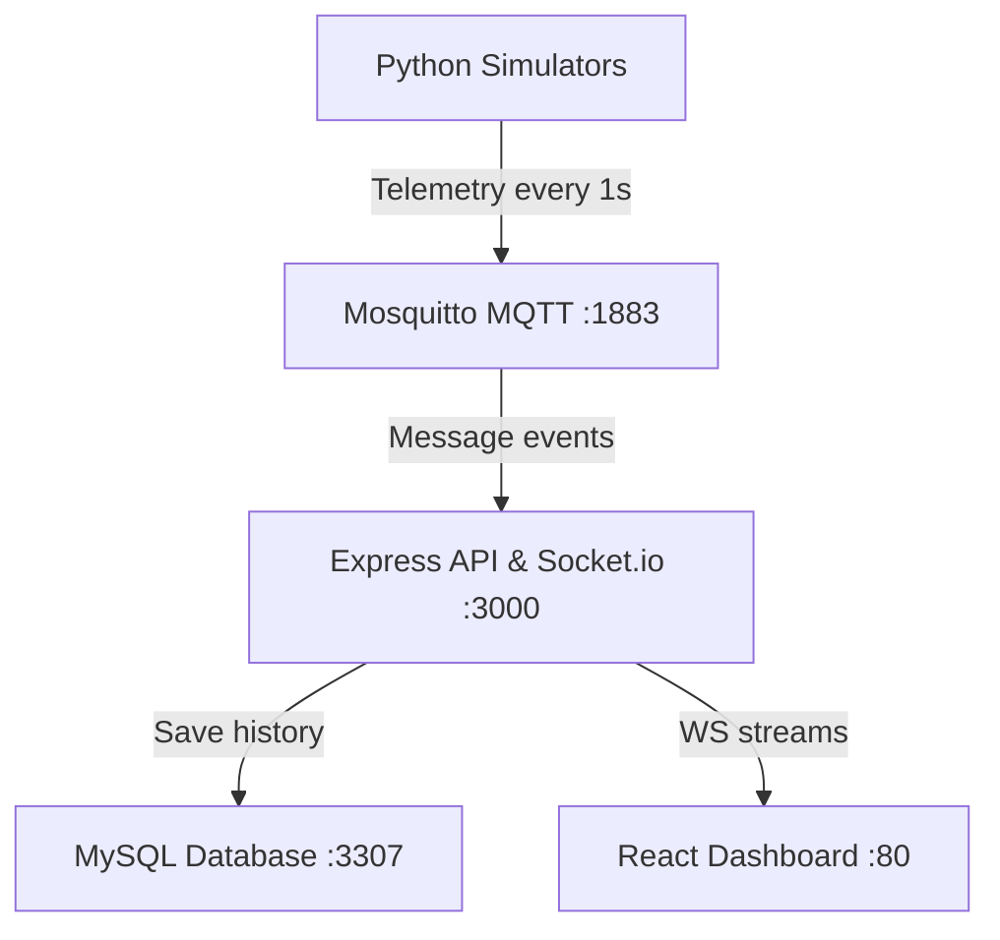

# Système d'Information Voyageurs (SIV) - Full-Stack IoT Fleet Dashboard

This project is a real-time full-stack IoT Passenger Information System designed to monitor a public transit fleet. It features multi-threaded Python simulators, an MQTT broker, an Express backend with WebSockets, and a React frontend served via Nginx.

---

## 🏗️ Architecture System



- **Frontend**: Vite + React, Leaflet Maps, and Socket.io-client.
- **Backend**: Express REST API, Node MQTT subscriber, and Socket.io server.
- **MQTT Broker**: Eclipse Mosquitto routing GPS coordinates and CAN telemetry.
- **Database**: MySQL database storing fleet history, routes, and alert logs.
- **Simulators**: Python scripts running dynamic GPS and CAN threads for active buses.

---

## ✨ Key Features

1. **OSRM Road Routing**: Buses follow Casablanca's actual streets (resolved via Open Source Routing Machine API) instead of flying in straight lines.
2. **Auto-Spacing**: Fleet buses automatically initialize at different segments along their paths to avoid overlapping/grouping.
3. **Interactive Tracking Focus**: Click a map marker or a sidebar card to auto-center/zoom in on a bus. The map pans smoothly to track it while preserving your zoom level. Re-click to toggle track focus off.
4. **1-Second Real-Time Telemetry**: Map positions and CAN telemetry (speed, fuel, temp, odometer, doors) update every second.
5. **Incident Center**: Real-time alerts are raised on the dashboard when critical thresholds are crossed (e.g. low fuel, engine overheat).

---

## 🛠️ Run the Application (Local Docker Stack)

Ensure you have [Docker](https://www.docker.com/) and [Docker Compose](https://docs.docker.com/compose/) installed, then run:

```bash
docker-compose up -d --build
```

### Access Ports:
- **Frontend Dashboard**: [http://localhost](http://localhost) (Port 80)
- **Backend REST API**: [http://localhost:3000/api](http://localhost:3000/api)
- **MySQL Database**: `localhost:3307`
- **MQTT Broker**: `localhost:1883`

Shutdown command:
```bash
docker-compose down
```

---

## 🎲 Testing Dynamic Routing & Spawning

1. Open the dashboard at [http://localhost](http://localhost) and go to **Gestion Flotte**.
2. Click **🎲 Générer un Bus Aléatoire** to spawn a new bus at random coordinates in Casablanca.
3. Open **Mode Itinéraire** on the dashboard, click two points on the map, and watch the bus appear and start traveling along the street layout **instantly** (with no startup delay).
4. View live simulator output using:
   ```bash
   docker logs -f siv-gps-simulator
   ```
